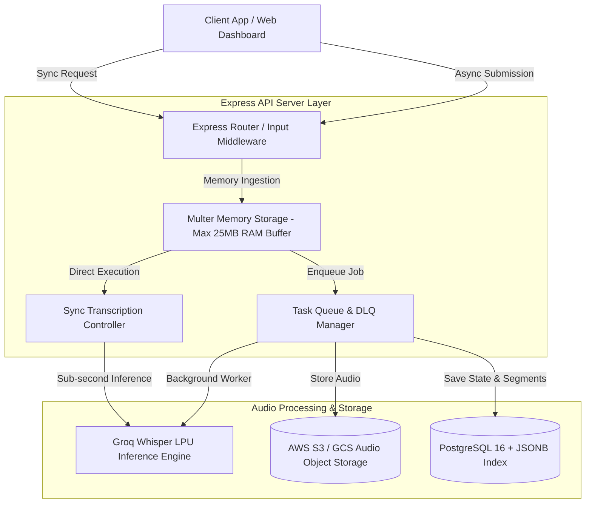

# Enterprise Speech-to-Text (STT) Processing Backend

An enterprise-grade Speech-to-Text (STT) processing backend built with Express 5, TypeScript, and Groq Whisper LPUs. This service provides dual-mode transcription with sub-second synchronous API execution and decoupled asynchronous queue processing capable of handling large-scale batch audio pipeline workflows.

---

## About Project

This system bridges fast API processing with enterprise resilience. It handles audio uploads up to 25 MB directly in volatile memory, processes transcriptions via Groq's low-latency Whisper models (`whisper-large-v3` and `whisper-large-v3-turbo`), and maintains job tracking with exponential backoff retries and Dead Letter Queue (DLQ) support.

---

## Key Features

* **Dual Processing Modes:** Real-time synchronous STT (`POST /api/transcribe`) and asynchronous batch queuing (`POST /api/v1/transcriptions`).
* **In-Memory Audio Pipeline:** Zero-disk I/O architecture using Multer memory storage buffers to prevent disk wear and upload race conditions.
* **Decoupled Task Queue:** Asynchronous job engine handling background executions, state polling, and automated retry logic.
* **Dead Letter Queue (DLQ) & Resilience:** Poison-pill isolation with manual retry triggers (`POST /api/v1/transcriptions/:jobId/retry`) and exponential backoff.
* **System Design Metadata Inspection:** Embedded DDL schema and S3 storage layout inspection endpoint (`GET /api/v1/system-design/schema`).
* **Type-Safe Validation:** Full Request/Response validation powered by Zod and Drizzle ORM integration.

---

## System Architecture & Design Decisions

### High-Level Architecture (HLD)



### Low-Level Architectural Decisions (LLD)
Code snippet
graph LR
    subgraph Audio Signal & Queue Engine
        A[Incoming Audio Buffer] -->|Validation| B{Payload Check}
        B -->|Pass| C[In-Memory Signal Preprocessing]
        C -->|Synchronous| D[Groq Whisper API]
        C -->|Asynchronous| E[Task Queue Worker Pool]
        
        E -->|Execution| F{Process Success?}
        F -->|Yes| G[Mark Completed & Save JSONB Transcript]
        F -->|No: Attempt < 3| H[Exponential Backoff Re-queue]
        F -->|Failed: Max Retries Exceeded| I[Move to Dead Letter Queue DLQ]
        
        I -->|Manual Re-trigger| J[DLQ Retry Endpoint]
        J -->|Reset Attempt Count| E
    end
    
### Architecture Audit Coverage Matrix

| Architectural Subsystem | Design Decision | Rationale / Benefit |
| :--- | :--- | :--- |
| **Ingestion Layer** | `multer.memoryStorage()` with 25MB cap | Eliminates disk I/O bottlenecks and temporary file clean-up edge cases. |
| **Execution Layer** | Groq Whisper LPUs (`whisper-large-v3-turbo`) | Delivers high-throughput speech inference up to 210x real-time speed. |
| **Data Storage** | PostgreSQL 16 + JSONB GIN Indexing | Enables high-performance querying over word-level timestamp arrays. |
| **Object Layout** | S3 Key Partitioning: `/audios/{user_id}/{job_id}.mp3` | Prevents hot-key distribution issues across S3 buckets. |
| **Fault Tolerance** | DLQ + Manual Re-queue Endpoint | Isolates invalid payloads without stalling the processing worker pipeline. |

---

## API Endpoints Summary

### Health & Configuration
* `GET /api/healthz` - Service liveness and readiness health check.
* `GET /api/transcribe/config` - Inspects Groq API connectivity and model specs.
* `POST /api/transcribe/test-key` - Validates custom Groq API key authenticity.

### Synchronous Pipeline (Part 1)
* `POST /api/transcribe` - Accepts audio binary or Base64 and returns instant transcript output.

### Asynchronous Pipeline (Part 2)
* `POST /api/v1/transcriptions` - Enqueues audio for background processing (Returns `202 Accepted`).
* `GET /api/v1/transcriptions/:jobId` - Fetches job status, retry history, and completed transcript.
* `GET /api/v1/transcriptions` - Lists recent jobs across queued, active, and completed states.
* `POST /api/v1/transcriptions/:jobId/retry` - Re-queues failed jobs from the Dead Letter Queue.
* `GET /api/v1/system-design/schema` - Exposes database DDL and S3 key layout.

---

## Sample Response Format

### Asynchronous Job Submission (`POST /api/v1/transcriptions`)
```json
{
  "job_id": "job_982f1a4c_8902",
  "status": "queued",
  "status_url": "/api/v1/transcriptions/job_982f1a4c_8902",
  "created_at": "2026-09-11T22:40:00.000Z",
  "s3_object_path": "/audios/usr_team_prod/job_982f1a4c_8902.mp3",
  "file_name": "meeting_recording.wav",
  "file_size_bytes": 4194304,
  "model": "whisper-large-v3",
  "message": "Transcription task successfully queued for asynchronous worker processing."
}
```

### Job Status Retrieval (`GET /api/v1/transcriptions/:jobId`)
```json
{
  "job_id": "job_982f1a4c_8902",
  "user_id": "usr_team_prod",
  "status": "completed",
  "created_at": "2026-09-11T22:40:00.000Z",
  "updated_at": "2026-09-11T22:40:02.150Z",
  "attempt_count": 1,
  "max_retries": 3,
  "result": {
    "text": "Welcome to the engineering architecture review.",
    "language": "en",
    "segments": [
      {
        "id": 0,
        "start": 0.0,
        "end": 2.4,
        "text": "Welcome to the engineering architecture review."
      }
    ]
  }
}
```

---

## Local Quickstart Guide

### Prerequisites
* Node.js v20.x or higher installed.
* pnpm package manager installed.
* A valid Groq API Key (with access to Whisper models).

### Setup Steps

1. **Clone repository and navigate to API server directory:**
   ```bash
   cd artifacts/api-server
   ```

2. **Install workspace dependencies:**
   ```bash
   pnpm install
   ```

3. **Configure Environment Variables:**
   Create a `.env` file inside `artifacts/api-server/` with the following contents:
   ```env
   PORT=8080
   NODE_ENV=development
   GROQ_API_KEY=your_groq_api_key_here
   LOG_LEVEL=info
   ```

4. **Run Development Mode:**
   ```bash
   pnpm run dev
   ```

5. **Build and Test Production Output:**
   ```bash
   pnpm run build
   pnpm run start
   ```
